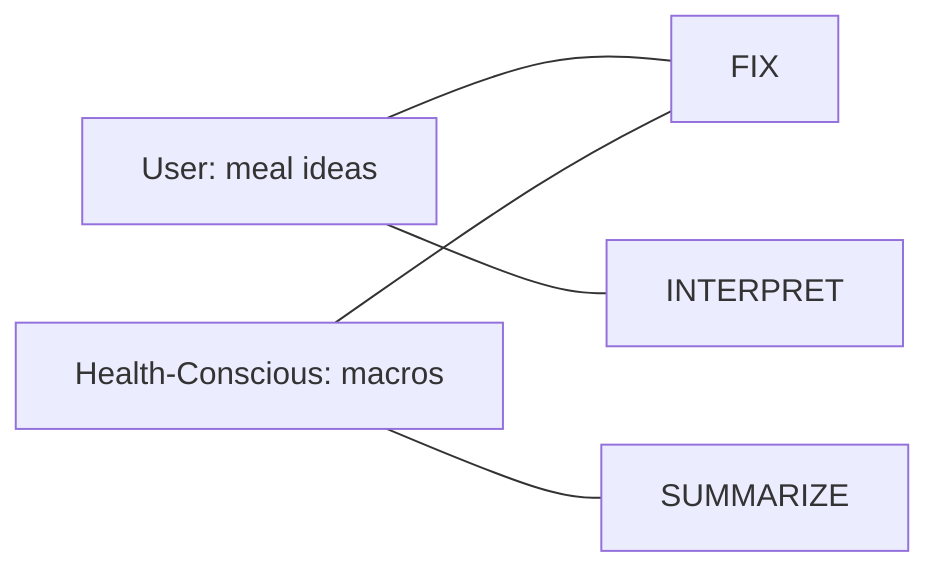
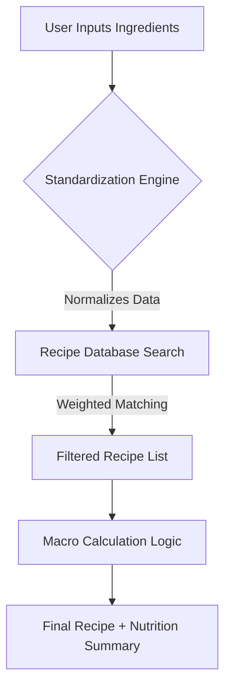

# Smart Pantry Chef — Product Design

## Define Your Tool

**Name:** Smart Pantry Chef.

---

## Stakeholders & Needs

List 1–2 stakeholders and one need each (e.g., Instructor — needs one-page press release; Student — needs clean data for analysis).

- **User** — needs meal ideas from the limited ingredients they already have.
- **Health-Conscious Cook** — needs accurate macro tracking to meet dietary goals.

---

## System Goals

List 2–3 system goals using core functions such as SUMMARIZE, FORMAT, INTERPRET, or FIX.

- **FIX** — Correct and normalize user input (e.g., "handful of spinach" → "30g spinach") for accurate data processing.
- **INTERPRET** — Analyze available ingredients against a recipe database to determine percentage match.
- **SUMMARIZE** — Provide a concise breakdown of total calories, protein, fats, and carbs for the chosen recipe.

---

## Mapping Goals to Needs

---

## Process Overview

---

## Key Technical Functions

To build this in Python, consider these core functional components.

### 1. The Parsing Engine (FIX)

- **Role:** Takes the raw user string and uses fuzzy matching or a dictionary-based lookup to map ingredients to a standardized database (e.g. USDA FoodData Central).
- **Task:** Standardize units (grams, ounces, counts).
- **Algorithm:** Levenshtein distance or a Trie structure for quick autocomplete/lookup.

### 2. The Recipe Matcher (INTERPRET)

- **Role:** Implements a Set Intersection or a Weighted Graph to rank recipes.
- **Task:** Rank recipes by how many "user-owned" ingredients they contain vs. "missing" ingredients.
- **Logic:** Prioritize recipes where the primary protein (e.g. meat) matches what the user has.

### 3. The Macro Aggregator (SUMMARIZE)

- **Role:** Once a recipe is selected, calculates the total nutritional profile.
- **Task:** Multiply the quantity of each ingredient by its nutritional value per unit.
- **Output:** A clean table showing:
  - Total Calories
  - Protein (g)
  - Carbohydrates (g)
  - Fats (g)
